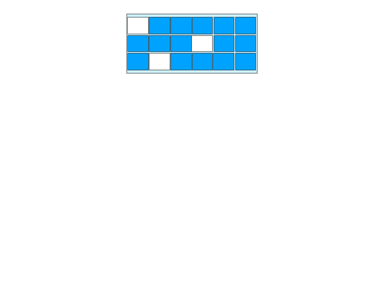
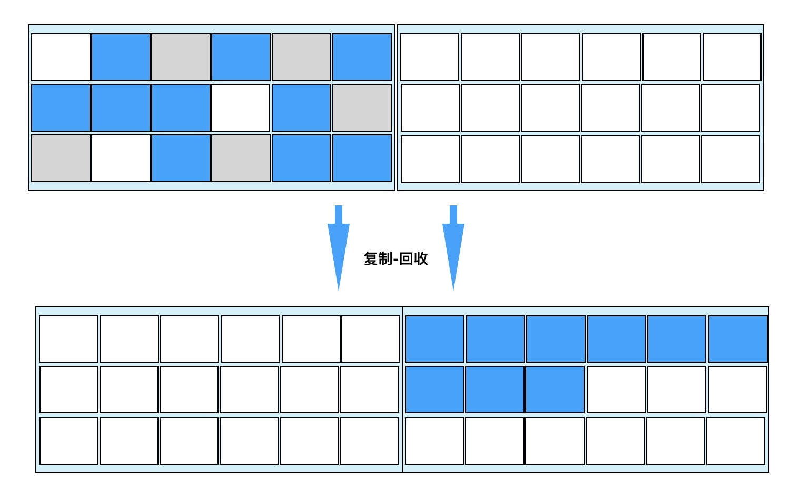
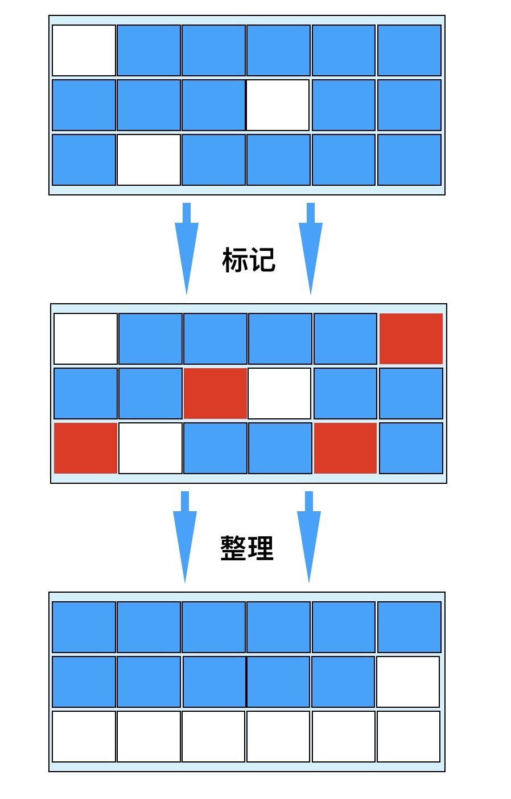
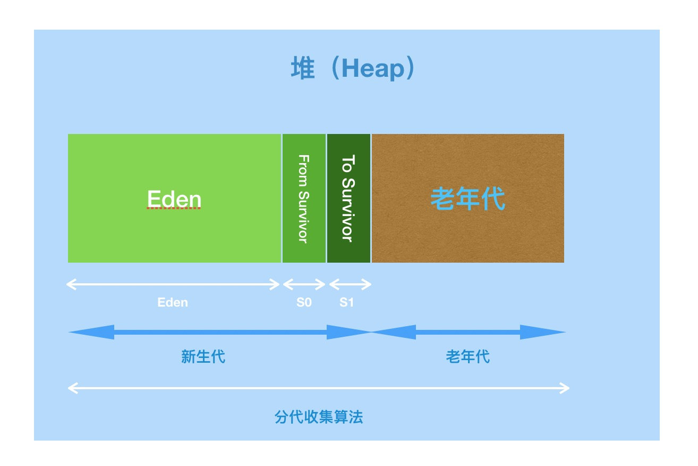

## 文档编写要求

## 1，代码块里面只写基础算法，基础知识等。在外部写面试问题，或者其他问题

## 2，所有的文字均是基于自己的理解，及网上的资料，及书上的资料所写，圈1是自己的注解


# Java8 JVM相关

## 类的加载


```
双亲委托加载机制

```


## 虚拟机内存模型


```
1，虚拟机栈 VM stack
每个线程都有着自己的一个私有的栈，栈里面存的是一种叫做栈帧（frame）的东西，每一个方法都会创建一个栈帧，栈
	（① 其实main方法也是一个主线程，其他的线程依托他进行多线程开发）
帧存放的是局部变量表（也就是基本数据类型和对象的引用）、操作数栈、方法出口等信息。栈的大小可以固定也可以动
	（① 根据阿里云课程，MLDN李兴华老师课程所写，一个对象的引用左边是放在栈里面的，new的对象本身是放在堆	  （里面的。根据曾林魁老师所写，int double等变量，全部放在栈内存里面）
态扩展。当栈的调用深度大于JVM规范所允许的范围，就会抛出StackOverflowError错误，不过这个规范范围不是一个确定的数。
package com.paddx.test.memory; 
public class StackErrorMock {    
	private static int index = 1;     
	public void call(){        
		index++;        
		call();    
	}     
public static void main(String[] args) {        
	StackErrorMock mock = new StackErrorMock();        
	try {            
		mock.call();        
	}catch (Throwable e){            
		System.out.println("Stack deep : "+index);            
		e.printStackTrace();        
		}    
	}
}
运行三次会发现，报错的三次的值都是不一样的。
还有一类错误，OutOfMemoryError申请不到内存错误，

2，本地方法栈	native method stack
虚拟机使用的 native 方法 

3，PC寄存器，也称程序计数器。
JVM支持多个线程同时运行，每个线程都由自己的程序计数器。如果当前执行的是JVM方法，则该寄存器中保存当前执行指令的地址，如果执行的native方法，则PC寄存器为空

4，堆 heap
堆内存是JVM所有线程共享的部分，所有的对象都在堆上进行分配，这部分空间可以通过GC进行回收，当申请不到空间时抛出OutOfMemoryError，无限创建对象获取内存即可。

4-1 生命周期
创建：在虚拟机启动的时候就创建
销毁：


5，方法区 method area
方法区也是JVM所有线程共享的，主要用于存储类的信息、常量池、方法数据、方法代码等。
方法区在逻辑上属于堆的一部分。


```

```
永久代，permgen 方法区概念的实现

java.lang.OutOfMemoryError: PermGen space，PermGen space其实就是方法区，但是两者又有着本质上的区别
方法区是JVM的规范，永久代是JVM规范的一种实现。
	https://www.cnblogs.com/charlesblc/p/5993804.html
	http://book.2cto.com/201306/25434.html
	https://www.cnblogs.com/baxianhua/p/9528192.html
	网址在介绍：什么是HotSpot VM
只有HotSpot才有永久代，对于其他类型的虚拟机并没有这个（如 JRockit（Oracle）、J9（IBM））
由于方法区主要存储类的相关信息，所以动态生成类的时候，比较容器出现永久代的内存溢出。
JDK1.7版本才有永久代，在JDK1.8中HotSpot已经没有永久代这个区间了，取而代之的是 Metaspace元空间
```

```
元空间 metaspace —— 代替永久代，方法区的新实现

发展背景：其实移除永久代的工作，1.7就开始了，JDK1.7的时候，存储在永久代的部分数据就已经转移到了java heap堆 和 native heap堆里面。永久代仍然存在于jdk1.7中，并没有完全移除。
符号引用（symbols）转移到native heap中
字面量（Interned strings）转移到java heap中
类的静态变量（class statics）转移到java heap中
字符串常量 由永久代转移到了堆中，并且jdk1.8中已经不存在永久代了


元空间：和永久代类似，都是对JVM规范中方法区的实现。
不过元空间和永久代的最大区别在于，元空间不在虚拟机中，而是使用本地内存，因此元空间受本地内存的影响。
-xx:MetaspaceSize：初始空间的大小，达到该值就会触发垃圾回收器进行类型卸载，同时GC会对该值进行调整，如果释放了大量的空间，就适当降低该值；如果释放了很少的空间，那么在不超过 MaxMetaspaceSize
-xx:MaxMetaspaceSize，最大空间，默认是没有限制的

-XX:MinMetaspaceFreeRatio:在GC后，最小的metaspace剩余空间容量的百分比，减少为分配空间所导致的垃圾收集
-XX:MaxMetaspaceFreeRatio:在GC后，最大的metaspace剩余空间容量的百分比，减少为释放空间所导致的垃圾收集

```


## GC 判断对象是否成活算法

 https://blog.csdn.net/yjp198713/article/details/78759933  永久代，元空间，未看

```
垃圾回收介绍
通常被称为“GC”，由虚拟机自主完成的操作
```


```
垃圾回收器——判断对象是否成活算法
1，引用计数算法
给对象添加一个引用计数器，每当有一个地方添加它时，计数器加1，引用释放时计数减1，当计数器为0时，可以进行回收。
引用计数算法的优点：实现简单，判断高效
引用计数算法的缺点：无法解决对象相互循环引用的问题

2，可达性分析算法
从GC-ROOT作为起点，基于对象的引用关闭，开始乡下搜索，搜索过得路径称为引用链，当一个对象没有引用链到达时，证明对象不可用。

```


```
可达性分析算法：为了保证在分析过程中的对象引用关系没有发生改变，就必须在分析的时候暂停所有的java线程，sun将这一事件称为stop the world

垃圾收集器相关
https://segmentfault.com/a/1190000020799424#articleHeader8
```


## GC 清理死亡对象算法

```
垃圾回收器--清理死亡对象算法
1，标记清除算法（如下图所示）
包含标记和清除两个阶段，首先标记出需要回收的对象，在标记完成后统一回收掉所有被标记的对象。
标记清除算法是最基础的算法， 后续的算法通过改进该思路获得的

缺点：
1，效率太低，标记的过程和清除的过程都太慢，
2，空间标记清除后产生了大量的不连续的内存碎片，空间碎片太多可能会导致在运行程序的时候，需要过大内存可能会重新触发一次垃圾收集动作。
```



```
2，复制算法
将可用的内存分为两块，每次只需要使用其中的一块。当一块内存用完了，就将还存活的对象复制到另一块上，然后清空之前的那块内存
每次对半区内存回收时，内存分配就不用考虑内存碎片的复杂情况，只需要移动内存指针分配就可分配内存了。

缺点：会将内存分为两半，性价比低，持续复制 长生存周期的对象，导致效率低下

JVM堆中新生代就是采用此复制算法，进行垃圾对象的清理。
```



```
3，标记整理算法
标记的过程，和标记清除的算法一样，但是不是直接对可回收对象进行清理，而是让所有存活的对象都向一端移动，然后直接清理边界以外的内存
```




```
4，分代收集算法
将堆内存逻辑上分为两块，新生代和老生代，很对不同的存货周期、不同的大小的对象采用不同的垃圾回收策略。

在新生代中，大多数对象都是瞬间的对象，只有少量对象存活，使用复制算法将内存变成两半即可以完成清理。
在老年代中，存活率较高，又没有额外的的担保内存，因此采用标记整理方法

分代收集办法：对新生代和老年代从策略维度的规划。
```



```
新生代的分类：：Eden空间、From Survivor（S0）空间、To Survivor（S1）空间。

```


> 
>
> 问题：哪些垃圾会被回收
>
> JVM中，程序计数器、虚拟机栈、本地方法栈3个区域，随线程而生，随线程而灭。栈帧随着方法的进栈和出栈操作，实现自动的内存清理。因此，GC回收主要在堆和方法区，


垃圾回收器什么时候回收内存：


#  java SE 面试题

## 抽象类和接口的区别

```
1，抽象类只能够被继承一次，但是接口可以被实现多次
2，抽象类里面可以选择性的实现父类的方法，接口类继承必须实现父类里面的所有方法，因为父接口里面不会实现任何方法。
3，抽象类里面可以有构造器，接口类里面不可以有构造器


```

## 重载和重写的区别

```
1，重载是发生在同一类里面的，主要实现是构造方法，和普通方法上。方法名称必须相同，方法参数数量的不同，参数顺序的不同，方法返回值不同。，
2，重写是发生在子类和父类里面的，方法名称和参数顺序必须相同，访问修饰符小于等于父类。返回值范围小于等于父类，抛出的异常小于等于父类。

```

## stringbuilder 和 stringbuffer的区别

```
stringbuffer是线程安全的，stringbuilder是线程不安全的。
stringbuffer基于同步锁对字符串的拼接操作进行了加锁，所以stringbuffer的效率会比较慢。

```

## 集合的体系架构

```
java.util包下，有collection接口为接口的父类。同时有一个collections的接口工具类。

collection接口下有三个接口，map双列集合，set的hash单列集合，list的单列有序集合

map接口下有hashmap，linkedlistmap，hashtable，properties

set接口下有hashset，treeset

list接口下有，arrarylist，linkedlist，vector


```

## arrarylist，linkedlist，vector的区别

```
arrarylist是动态数组，底层是arrary，只是会自己扩容，每次扩容都会扩容50%。
整个数组必须占用，一块连续的内存。然后在获取好末尾增加的时候，非常快速。但是在插入和删除的时候，必须将在索引处，连续的内存进行移动

linkedlist是链表，每个节点占用一个内存片段，每个节点都有两个指针，指向前一个和后一个节点，用来描述节点间的关闭。
在插入和删除的时候，可以直接从头遍历一遍，到达需要插入删除的节点处，对前一个节点的后指针和后一个节点的前指针进行指到新节点的操作。但是获取数据的时候，必须从头遍历一遍才能够找到数据

vector每次扩容都会扩容100%，

```

    ## hashMap 和 HashTable 的区别

```
主要的区别在于hashmap是线程不安全的，效率会高一点

hashtable的key-value存储的时候都不可以为空
hashmap的key-value存储的时候都可以为空。（value输出空）
```

## java gc机制的理解

```
GC的作用主要是 找到需要清理的内存 和 直接清理需要清理的内存

寻找内存使用的算法：可达性算法， 引用计数算法
可达性算法是从gc root出发，当一些对象没有被引用的时候，会被标记为需要回收
引用计数算法是每当一个对象被引用一次时，就会计数+1，当计数为0的时候会被标记需要回收。

清理内存使用的算法：标记清除，复制算法，标记整理，分代清除
标记清除：分为两个阶段，标记阶段和清除阶段，首先标记所有的需要清除的内存，然后统一删除所有需要清除的内存
	缺点：清除后的内存都是碎片化的，当需要大内存的时候，可能会不够，需要再次执行；
复制算法：将内存划分成两块，当内存是存活的时候，会从一块内存转移到另一块内存。
	缺点：将内存划分成两块，影响性能。
标记整理：


```


# 其他


## 3，IO流

```
IO流读取UTF-8文件仍然乱码问题

读取 TXT 的 utf-8 （用nootpad转码） 文件，仍然是乱码的

//        1，加载文件
        String path = "";
        try {
            path = SensitiveWordsFilter.class.getClassLoader().getResource("敏感词汇.txt").getPath();
        } catch (NullPointerException e) {
            System.out.println("  没有找到文件  ");
            e.printStackTrace();
        }
//        2，读取文件
        BufferedReader bufferedReader = null;
        Reader reader = null;
        try {
//            inputStreamReader = new InputStreamReader(new FileInputStream(path), StandardCharsets.UTF_8);
            reader = new InputStreamReader(new FileInputStream(path), StandardCharsets.UTF_8);


            bufferedReader = new BufferedReader(reader);

//        3，将文件的每一行添加到list
            String tempStr = null;
            while ((tempStr = bufferedReader.readLine()) != null) {
                strArrList.add(tempStr);
            }
```

​	

## 4，多线程

## 5，多线程 —— 锁

```
WEB 里面有
```


# ArraryList 和 Vector 和 LinkedList

```
ArraryList 

默认构建一个的空数组
private static final Object[] DEFAULTCAPACITY_EMPTY_ELEMENTDATA = {};
public ArrayList() {
    this.elementData = DEFAULTCAPACITY_EMPTY_ELEMENTDATA;
}
有容量的的是设置成容量，否则就是空数组
public ArrayList(int initialCapacity) {
        if (initialCapacity > 0) {
            this.elementData = new Object[initialCapacity];
        } else if (initialCapacity == 0) {
            this.elementData = EMPTY_ELEMENTDATA;
        } else {
            throw new IllegalArgumentException("Illegal Capacity: "+
                                               initialCapacity);
        }
    }

public boolean add(E e) {
        ensureCapacityInternal(size + 1);  // Increments modCount!!
        扩容后添加
        elementData[size++] = e;
        return true;
    }
private void ensureCapacityInternal(int minCapacity) {
        ensureExplicitCapacity(calculateCapacity(elementData, minCapacity));
    }
添加的时候，会进行数组的判断。
private static int calculateCapacity(Object[] elementData, int minCapacity) {
		判断当前的elementData是不是个空数组
        if (elementData == DEFAULTCAPACITY_EMPTY_ELEMENTDATA) {
        	是的话，返回默认的数组容量 DEFAULT_CAPACITY 为10
            return Math.max(DEFAULT_CAPACITY, minCapacity);
        }
        不为空直接返回 size+1 
        return minCapacity;
    }
private void ensureExplicitCapacity(int minCapacity) {
        modCount++;
		
        // overflow-conscious code
        如果size+1的容量大于当前数组的容量，或者是大于数组扩容后的容量
        if (minCapacity - elementData.length > 0)
        	则再次进行扩容
            grow(minCapacity);
    }

private void grow(int minCapacity) {
        // overflow-conscious code
        将当前的数组容量，赋值给一个变量
        int oldCapacity = elementData.length;
        进行扩容，新的int为当前的1.5倍，10-15-22
        int newCapacity = oldCapacity + (oldCapacity >> 1);
        如果扩容后的减去当前的数组容量，还小，异常
        if (newCapacity - minCapacity < 0)
            newCapacity = minCapacity;
        如果扩容后的容量大于maxvalue-8，异常
        if (newCapacity - MAX_ARRAY_SIZE > 0)
            newCapacity = hugeCapacity(minCapacity);
        // minCapacity is usually close to size, so this is a win:
        开始扩容
        elementData = Arrays.copyOf(elementData, newCapacity);
    }
 
根据索引删除方法
public E remove(int index) {
        rangeCheck(index);

        modCount++;
        获取索引处的数据
        E oldValue = elementData(index);
		numMoved = 当前数组长度，减去输入的长度，减去1
		获得需要删除的索引后面的数组长度
        int numMoved = size - index - 1;
        
        if (numMoved > 0)
        //src源数组，srcPos源数组的起始位置，dest目标数组，destPos目标数组的起始位置
        //length需要复制的数量
        //源数组从输入的索引处+1开始，目标数组从输入的索引处开始
        //也就是说不考虑输入的索引前面的数据，只考虑索引后的
        //arraycopy(Object src,  int srcPos, Object dest, int destPos, int length);
            System.arraycopy(elementData, index+1, elementData, index, numMoved);
        复制完成后的数组，输入索引处的元素，被后面一个元素代替了。
        elementData[--size] = null; // clear to let GC do its work GC处理，无用

        return oldValue;
    }

根据输入的元素删除
public boolean remove(Object o) {
		输入为空
        if (o == null) {
        	遍历一遍，看看是否有人为空
            for (int index = 0; index < size; index++)
            	有人为空，获得索引，进行删除
                if (elementData[index] == null) {
                    fastRemove(index);
                    return true;
                }
        } else {
        	不如空，则进行字符串，或者是传入的对象的equals的比较
            for (int index = 0; index < size; index++)
            	则进行object内存地址的比较，如果是string则进入string比价，等等。
                if (o.equals(elementData[index])) {
                    fastRemove(index);
                    return true;
                }
        }
        return false;
    }
有人为空，获得索引，进行删除    
private void fastRemove(int index) {
        modCount++;
        int numMoved = size - index - 1;
        if (numMoved > 0)
            System.arraycopy(elementData, index+1, elementData, index,
                             numMoved);
        elementData[--size] = null; // clear to let GC do its work
    }

修改参数
public E set(int index, E element) {
        rangeCheck(index);
		
        E oldValue = elementData(index);
        直接修改
        elementData[index] = element;
        return oldValue;
    }
    
get方法  
public E get(int index) {
		检查输出的长度容量
        rangeCheck(index);

        return elementData(index);
    }
E elementData(int index) {
		返回对应输出索引处
        return (E) elementData[index];
    }

```

```
Vector

默认容量10
public Vector() {
        this(10);
    }
public Vector(int initialCapacity) {
        this(initialCapacity, 0);
    }

public Vector(Collection<? extends E> c) {
        elementData = c.toArray();
        elementCount = elementData.length;
        // c.toArray might (incorrectly) not return Object[] (see 6260652)
        if (elementData.getClass() != Object[].class)
            elementData = Arrays.copyOf(elementData, elementCount, Object[].class);
    }


```


```
LinkedList


```


# HashMap

 HashMap的时间复杂度？HashMap中Hash冲突是怎么解决的？链表的上一级结构是什么？Java8中的HashMap有什么变化？红黑树需要比较大小才能进行插入，是依据什么进行比较的？其他Hash冲突解决方式？ 

```
hash冲突的解决
1，再哈希法
2，链地址法
```


```
hahsmap：put的使用

首先会对key进行hashcode的运算，然后返回

根据key值，通过hashcode，和位运算获取hash值
h = key.hashCode()) ^ (h >>> 16
```

```
final V putVal(int hash, K key, V value, boolean onlyIfAbsent, boolean evict) {
		//evict无用
        Node<K,V>[] tab; 
        Node<K,V> p; 
        int n, i;
        //当map为空时，进行初始化
        if ((tab = table) == null || (n = tab.length) == 0)
            n = (tab = resize()).length;
        //tab[i = (n - 1) & hash]会获得节点的下表，也就是索引
        //同时对p节点进行赋值
        if ((p = tab[i = (n - 1) & hash]) == null)
            //如果tab[i]节点为空了，插入新的值
            tab[i] = newNode(hash, key, value, null);
        else {
        	//如果不为空，则说明进行了hash冲突
            Node<K,V> e; 
            K k;
            //通过p节点的hash的运算，当下标的两个hash值相等，key相等，
            //说明是产生了hash冲突，对e进行赋值，将p赋值给e
            if (p.hash == hash && ((k = p.key) == key || (key != null && key.equals(k))))
                e = p;
            //如果p节点已经是个红黑树了
            else if (p instanceof TreeNode)
            	//转变成树形结构
                e = ((TreeNode<K,V>)p).putTreeVal(this, tab, hash, key, value);
            //该链是链表
            else {
                for (int binCount = 0; ; ++binCount) {
                	//如果是链表的话，则遍历一遍链表，进行下面的末尾操作
                    if ((e = p.next) == null) {
                    	//p节点.next，将新节点存放在尾部，
                        p.next = newNode(hash, key, value, null);
                        //当链表的长度大于8，开始进行红黑树操作
                        if (binCount >= TREEIFY_THRESHOLD - 1) // -1 for 1st
                            treeifyBin(tab, hash);
                        break;
                    }
                    e树形结构的节点，节点的hash的运算，当下标的两个hash值相等，key相等，
                    if (e.hash == hash && ((k = e.key) == key || (key != null && key.equals(k))))
                        break;
                    p = e;
                }
            }
            if (e != null) { // existing mapping for key
                V oldValue = e.value;
                if (!onlyIfAbsent || oldValue == null)
                    e.value = value;
                afterNodeAccess(e);
                //返回原来的值
                return oldValue;
            }
        }
        ++modCount;
        if (++size > threshold)
            resize();
        afterNodeInsertion(evict);
        return null;
    }
```

```
final Node<K,V>[] resize() {
        Node<K,V>[] oldTab = table;
        //如果数组的长度为空就返回0，不为空返回数组的长度。
        int oldCap = (oldTab == null) ? 0 : oldTab.length;
        int oldThr = threshold;
        int newCap, newThr = 0;
        如果数组大于0，
        if (oldCap > 0) {
            if (oldCap >= MAXIMUM_CAPACITY) {
                threshold = Integer.MAX_VALUE;
                return oldTab;
            }
            else if ((newCap = oldCap << 1) < MAXIMUM_CAPACITY &&
                     oldCap >= DEFAULT_INITIAL_CAPACITY)
                newThr = oldThr << 1; // double threshold
        }
        else if (oldThr > 0) // initial capacity was placed in threshold
            newCap = oldThr;
        else {               // zero initial threshold signifies using defaults
            newCap = DEFAULT_INITIAL_CAPACITY;
            newThr = (int)(DEFAULT_LOAD_FACTOR * DEFAULT_INITIAL_CAPACITY);
        }
        if (newThr == 0) {
            float ft = (float)newCap * loadFactor;
            newThr = (newCap < MAXIMUM_CAPACITY && ft < (float)MAXIMUM_CAPACITY ?
                      (int)ft : Integer.MAX_VALUE);
        }
        threshold = newThr;
        @SuppressWarnings({"rawtypes","unchecked"})
        Node<K,V>[] newTab = (Node<K,V>[])new Node[newCap];
        table = newTab;
        if (oldTab != null) {
            for (int j = 0; j < oldCap; ++j) {
                Node<K,V> e;
                if ((e = oldTab[j]) != null) {
                    oldTab[j] = null;
                    if (e.next == null)
                        newTab[e.hash & (newCap - 1)] = e;
                    else if (e instanceof TreeNode)
                        ((TreeNode<K,V>)e).split(this, newTab, j, oldCap);
                    else { // preserve order
                        Node<K,V> loHead = null, loTail = null;
                        Node<K,V> hiHead = null, hiTail = null;
                        Node<K,V> next;
                        do {
                            next = e.next;
                            if ((e.hash & oldCap) == 0) {
                                if (loTail == null)
                                    loHead = e;
                                else
                                    loTail.next = e;
                                loTail = e;
                            }
                            else {
                                if (hiTail == null)
                                    hiHead = e;
                                else
                                    hiTail.next = e;
                                hiTail = e;
                            }
                        } while ((e = next) != null);
                        if (loTail != null) {
                            loTail.next = null;
                            newTab[j] = loHead;
                        }
                        if (hiTail != null) {
                            hiTail.next = null;
                            newTab[j + oldCap] = hiHead;
                        }
                    }
                }
            }
        }
        return newTab;
    }
```


# 设计模式

```
单例模式-饿汉式
```

```
单例模式-懒汉式
```

```
代理模式
```

```
工厂模式
```


# 网络编程
TCP
	A：主动请求方
	B：被动接收方

	TCP的三次握手，四次挥手
	
	三次握手：
	1-1，A向B发送同步请求，请求链接并进入SYN_Sent状态，等待服务器进行确认。		SYN：同步序列编号，
	2-1，B收到A的SYN包，但是必须确认A的SYN（ACK=x+1），于是B向A发送一个SYN包，同时自己进入SYN_RECV状态
	3-1，A收到B的SYN包，向服务器发送确认包，此包发送完毕，A和B进入ESTABLISHED（TCP链接成功）状态，完成三次握手
		
	四次挥手：
	1-1，A向B发送链接释放报文，并且停止发送数据，A进入FIN_WAIT-1（终止等待1状态）
	1-2，B收到 链接释放的报文，发出确认的报文，B进入CLOSE_WAIT（关闭等待）。
	2-1，A收到 确认的报文，A进入FINA_WAIT-2（终止等待2），等待B发送链接释放报文，（在此阶段，仍然还需要接收B发送的数据）
	2-2，B将最后的数据发送完之后，就向A发送链接释放报文，B进入LAST_ACK状态
	3-1，A收到 链接释放的报文后，必须发出确认，A进入TIME_WAIT等待，经过2MSL（最长报文段寿命），客户端撤销相应的TCB后，进入CLOSE状态
	4-1，B收到 A发出的确认报文，立即进入CLOSE状态

```
TCP的分层以及对应的协议相关

	应用层
		协议：FTP，SMTP，TELNET
		
```


	网络编程的子网掩码
	
	在不同的网络之间实现分组的存储和转发，并在网络层提供协议转换，路由器
	
	子网掩码
	168.192.33.124/26 子网掩码IP地址块可以写为	255.255.255.192
	
	1，CIDR斜线记法
	IP地址/n
	例1：192.168.1.100/24，其子网掩码表示为255.255.255.0，二进制表示为11111111.11111111.11111111.00000000
	例2：172.16.198.12/20，其子网掩码表示为255.255.240.0，二进制表示为11111111.11111111.11110000.00000000
	
	计算机是怎么确定哪个应用程序使用该协议？
	IP：是用来唯一标识互联网计算机的逻辑地址，让电脑之间可以你相互通信。
	域名：由于IP地址是数学标识，使用时难以记忆，因此发展了符号化来代替数字，每一个符号化的地址，都与特定的IP地址对应。
	DNS：在网络上，域名和IP是一一对应的，或者多对一，机器只认识IP，他们之间的转换工具成为域名解析，域名解析需要专门的域名解析服务器来完成，域名的最终指向就是IP
	端口号：TCP/IP协议的端口号，范围从0-65535，比如用于浏览网页的80，用于FTP服务的21端口。
VPN
	在服务器和客户端，基于公共网络 建立专用的网络，进行加密的通信。		

通信线路
	全双工通信线路：
	
	局域网拓扑结构没有统一的模式
	
	在计算机网络中，能将异种网络互联起来，实现不同网络协议相互转换的网络互连设备是	网关


# 基础算法，排序，二分等

```
二分查找
	要求：表必须以顺序方式存储，不可以是链表，因为链表不知道中点在什么位置
```

```

```

```

```


# 数据结构

```
arrarylist
```

```
linkedlist
```

```
二叉树
```


# 其他

```
BS
```

```
CS
```


# 软件需求
软件需求规格说明的内容应包括 软件的主要功能